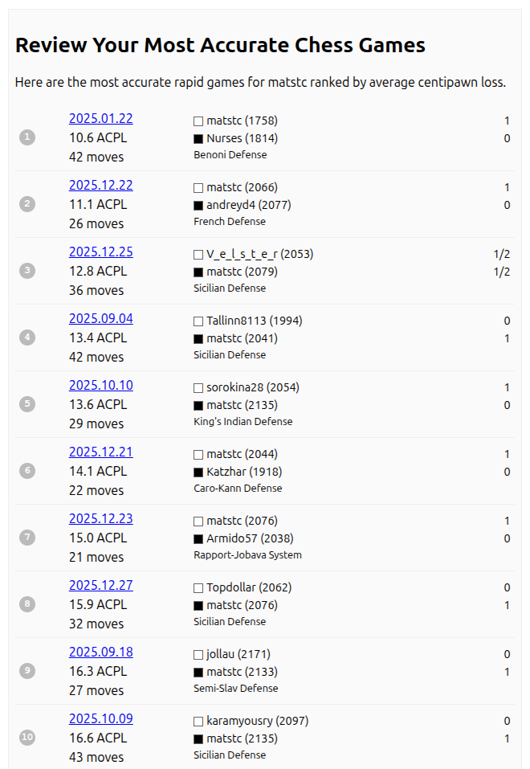

This is a mini app to list the most accurate chess games played by a Lichess user.

# Run

## Locally

`go run .`

## With Docker

```
docker build -t macg .
docker run --rm -p 8080:8080 macg
```

## Using Fly

`fly deploy`

<hr>



# Credits

See [font license](Atkinson-Hyperlegible-SIL-OPEN-FONT-LICENSE-Version 1.1-v2 ACC.pdf) for Atkinson Hyperlegible Next.
